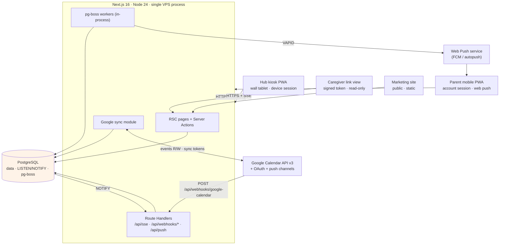

# Kynite — Architecture

**Status:** Draft for greenfield rebuild
**Date:** 2026-08-06
**Supersedes:** the 2025-12-21 architecture doc for the original Family Planner build.
**Inputs:** `docs/prd.md`, `docs/research/psychology-and-product-principles.md`

Decision-oriented. Every choice carries a one-line rationale. Stack is fixed and
not relitigated here; this document is about how the pieces fit.

---

## 0. Fixed stack

| Layer | Choice | Why |
|---|---|---|
| Framework | Next.js 16.3, App Router, Turbopack, `proxy.ts` | One deployable for SSR hub, mobile PWA, API and jobs host. |
| UI | React 19.2, TypeScript 7, Tailwind 4.3, shadcn CLI 4.x on Base UI | Base UI primitives give unstyled a11y behaviour; kiosk needs custom large-target skins. |
| DB | PostgreSQL + Drizzle 0.45 / drizzle-kit 0.31 | Typed SQL, migrations in repo, and Postgres doubles as our realtime bus and job queue. |
| Auth | better-auth 1.6 (email/password + Google OAuth, multi-account linking) | Needs several Google accounts per family; better-auth models linked accounts natively. |
| i18n | next-intl 4 (`nl` default, `en`) | Locale-segmented routing, server-side messages. |
| Realtime | SSE + Postgres `LISTEN/NOTIFY` | One-way fan-out is all we need; avoids a second stateful service (no Pusher, no WS server). |
| PWA | Serwist + VAPID web push | Serwist is the maintained Workbox successor with first-class Next support. |
| Jobs | pg-boss | Postgres-backed queue — no Redis, transactional with app writes. |
| Data layer | Server Actions + Route Handlers | No tRPC: Server Actions already give typed RPC; Route Handlers cover webhooks/SSE. |
| Celebration | canvas-confetti | Non-strobing, GPU-cheap, module-per-animation (FR10/FR11). |
| Tests | Vitest 4, Playwright 1.62 | Unit + E2E + visual regression. |
| Runtime/Deploy | Node 24, self-hosted VPS | Long-lived SSE connections and `LISTEN/NOTIFY` need a persistent process; serverless is disqualified. |

---

## 1. System overview

Four client surfaces, one Next.js server, one Postgres, Google APIs outbound and
inbound.



**Decisions**

- **Single Node process** hosts web, SSE and pg-boss workers. Rationale: one family
  per install, workloads are tiny, and jobs sharing the app's DB pool keeps
  writes transactional. Split workers out only if job latency starts affecting
  request latency.
- **Postgres is the only stateful dependency.** Rationale: a self-hosted VPS
  should have one backup target and one thing that can be down.
- **No BFF/API gateway.** Rationale: all clients are first-party and same-origin.

---

## 2. App structure

### Route groups

Route groups isolate surfaces with genuinely different layouts, auth models and
service-worker scopes.

```
src/app/
  [locale]/
    (marketing)/            # public landing, pricing, docs — static, no session
      page.tsx
    (auth)/                 # sign-in, sign-up, OAuth callback, invite accept
      sign-in/ sign-up/ invite/[token]/
    (app)/                  # parent mobile PWA — account session required
      layout.tsx            # bottom nav, mobile-first, ParentShell
      today/ calendar/ routines/ rewards/ family/ settings/
    (hub)/                  # kiosk — device session required, no account
      layout.tsx            # fullscreen, dark, 6-foot type, no browser chrome
      page.tsx              # ambient board (default surface)
      routines/[memberId]/ timers/ store/ pair/
    (share)/                # caregiver link view — signed token, read-only
      s/[token]/page.tsx
  api/
    sse/route.ts                       # GET, per-family event stream
    webhooks/google-calendar/route.ts  # POST, Google push channel target
    push/subscribe/route.ts            # POST, VAPID subscription upsert
    auth/[...all]/route.ts             # better-auth handler
    health/route.ts
  sw.ts                                # Serwist service worker entry
```

- **`(hub)` separate from `(app)`** — different session type, different a11y
  budget (48px+ targets, 6-foot legibility), different caching strategy. Sharing
  a layout would force every component to branch on surface.
- **`(share)` separate from both** — no session at all; must be impossible to
  reach a mutation from this tree. Enforced by the group having no Server Action
  imports and a proxy rule.
- **`(marketing)` separate** — no session cookie read, so it stays fully static
  and cacheable at the reverse proxy.

### src layout

```
src/
  app/              # routes only — no business logic
  modules/          # feature slices; the unit of ownership
    family/ calendar/ google/ routines/ rewards/
    timers/ realtime/ notifications/ devices/ sharing/
  components/
    ui/             # shadcn/Base UI primitives (generated)
    hub/            # kiosk-only, large-format
    app/            # parent-app
    celebration/    # confetti presets, one module per animation (FR11)
  server/
    db/             # drizzle client, schema/, migrations/
    auth.ts  jobs/  env.ts        # better-auth · pg-boss · zod-validated env
  lib/ i18n/ hooks/
messages/           # nl.json, en.json
```

### Module boundaries

Each `modules/<slice>` exposes exactly:

```
modules/routines/
  schema.ts   # drizzle tables owned by this slice
  queries.ts  # reads ("server-only")
  actions.ts  # Server Actions — the only mutation entry point
  events.ts   # realtime event types this slice publishes
  domain/     # pure functions: fade rules, step ordering, star award calc
  ui/         # slice-owned components
  index.ts    # public surface — cross-module imports go through here only
```

**Rules**

1. Cross-module imports must go through `index.ts`; deep imports are lint-banned
   (`eslint no-restricted-imports`). Rationale: keeps slices swappable.
2. `domain/` is pure and framework-free — that's where Vitest earns its keep.
3. Every mutation is a Server Action that: validates (zod) → authorizes →
   writes in a transaction → `NOTIFY`s → revalidates. No mutation logic in
   route handlers except webhooks.
4. Route files hold no logic; they compose module UI + queries.

---

## 3. Data model

Drizzle sketches — key columns and relations only, not full DDL. All ids are
`uuid` with `defaultRandom()`; all tables carry `createdAt`/`updatedAt` unless
stated. Every family-scoped table carries `familyId` so a single predicate scopes
every query (and, later, RLS).

### Identity & household

```ts
family    = { id, name, locale='nl', timezone='Europe/Amsterdam', weekStartsOn=1 }

// One row per human. Adults may or may not have a login; children never do.
member    = { id, familyId->family, userId->user|null,   // null = child / unclaimed adult
              displayName, avatarUrl, color,             // owns their colour everywhere
              role: 'owner'|'adult'|'child'|'caregiver',
              birthDate|null,
              rewardHorizon: 'instant'(4-7) | 'savings'(8-12),
              sortOrder }
// Rationale: member is decoupled from auth `user` so children and unclaimed
// second parents are first-class from day one — second-parent onboarding is
// claiming an existing member, zero data entry.

// better-auth owns user/session/account/verification. `account` holds linked
// Google login identities; we do not duplicate them.
```

### Devices & Google

```ts
device        = { id, familyId, name, kind:'hub'|'mobile',
                  pairedAt, lastSeenAt, revokedAt|null }   // secret lives in device_session

googleAccount = { id, familyId, ownerMemberId->member,
                  googleUserId unique, email,
                  accessToken, refreshToken,               // encrypted at rest
                  scopes[], tokenExpiresAt,
                  status:'active'|'reauth_required' }

calendar      = { id, familyId, googleAccountId->google_account,
                  googleCalendarId, summary, color,
                  visibility:'family'|'private',           // private = busy-only on hub
                  writable, syncEnabled=true,
                  syncToken|null, syncedAt|null,           // Google incremental cursor
                  channelId, channelResourceId, channelExpiration,
                  unique(googleAccountId, googleCalendarId) }
```

### Calendar events

```ts
event = { id, familyId, calendarId->calendar|null,   // null = Kynite-native event
          googleEventId|null, title, description, location,
          startsAt, endsAt, allDay, tz,              // original zone → DST-safe recurrence
          ownerMemberId->member|null,                // ownership → reminders route here
          attendeeMemberIds[],
          eventType:'appointment'|'custody'|'reward'|…,
          rrule|null, rdates[], exdates[],           // RFC-5545, stored verbatim
          recurrenceParentId->event|null,            // override instance
          etag, updatedAtRemote,                     // last-write-wins inputs
          deletedAt|null,                            // soft delete = Google tombstone
          version=0,                                 // bumped per write
          index(familyId, startsAt), unique(calendarId, googleEventId) }
```

**Recurrence decision.** Store RRULE + RDATE/EXDATE verbatim and expand on read
(cached per view window), rather than materialising every instance. Rationale:
it round-trips Google losslessly and it's the only model that expresses custody
weeks. Custody patterns we must express, all valid RRULE:

- alternating weeks → `FREQ=WEEKLY;INTERVAL=2;BYDAY=MO`
- 2-2-3 rotation → two RRULEs on one `custody` event series, or `INTERVAL=2`
  with `BYDAY` sets per parent
- "every 1st and 3rd weekend" → `FREQ=MONTHLY;BYDAY=FR;BYSETPOS=1,3`

Overrides (one swapped weekend) become child rows via `recurrenceParentId` +
an `EXDATE` on the parent — same shape Google uses, so sync is a passthrough.

### Routines, completions, stars

```ts
routine     = { id, familyId,
                ownerMemberId->member,               // whose routine → reminder routing
                title, icon,
                schedule: jsonb{ rrule, timeOfDay, graceDays },
                starsPerCompletion=1,
                rewardEnabled=true,                  // fade path: flip false per routine
                fadedAt|null,                        // "you do this on your own now"
                active=true, sortOrder }
// Fade is per-routine state, not a global setting — research §Decisions 7.

routineStep = { id, routineId->routine (cascade), title, icon, sortOrder,
                timerSeconds|null }                  // timer prescription

completion  = { id, familyId, memberId,
                routineId|null, routineStepId|null, eventId|null,
                occurrenceDate: date,                // logical day satisfied
                completedAt, source:'hub'|'mobile'|'auto',
                clientId,                            // idempotency key from client
                unique(memberId, routineStepId, occurrenceDate), unique(clientId) }
// Uniqueness on (member, step, day) makes double-taps and offline replays
// idempotent. There is no "uncompleted" state — undo deletes the row within a
// short window; a missed task is the absence of a row (dimmed, never a red X).

starLedger  = { id, familyId, memberId,
                amount,                              // CHECK (amount > 0) — append-only
                reason:'routine'|'bonus'|'manual'|'surprise',
                completionId|routineId|null,
                redemptionId->redemption|null, note, createdAt,
                index(familyId, memberId, createdAt) }
```

**Star ledger is append-only and non-negative. This is a hard invariant**
(research §Decisions 1: no star removal, ever).

- Rows are never updated or deleted; `CHECK (amount > 0)` at the DB level.
- Balance = `SUM(amount) - SUM(cost of approved redemptions)`, computed as a
  view `member_star_balance`. Spending is recorded on `redemption`, not as a
  negative ledger row — so "stars earned" (the number the child sees grow) is
  monotonic forever, while "stars available" is derived.
- No parent action can lower earned stars. A mistaken award is corrected by a
  parent conversation, not an app mechanic.
- Deliberate consequence: no cross-sibling aggregate surface exists in the
  schema layer we expose to child UI (research §Decisions 3).

### Rewards

```ts
reward     = { id, familyId, title, icon, imageUrl, costStars,
               category:'privilege'|'experience'|'treat',   // no money category, ever
               availableToMemberIds[],                      // per-child catalogue
               requiresApproval=true, active=true }

redemption = { id, familyId, memberId, rewardId,
               costStars,                                   // frozen at request time
               status:'requested'|'approved'|'denied'|'fulfilled',
               requestedAt, decidedAt, decidedByMemberId,
               createdEventId->event|null }                 // approved → Google Cal event
// Denied redemptions cost nothing; stars stay available. No penalty path.
```

### Sharing, push, devices

```ts
shareLink        = { id, familyId, tokenHash unique,        // raw token shown once
                     role:'viewer'|'contributor',
                     scope: jsonb{ memberIds?, calendarIds?, surfaces[] },
                     label, expiresAt|null, revokedAt|null, lastUsedAt, useCount }

pushSubscription = { id, familyId, memberId, deviceId|null,
                     endpoint unique, p256dh, auth,
                     userAgent, failureCount, lastSuccessAt }

deviceSession    = { id, deviceId->device, tokenHash,
                     expiresAt,                             // 1 year, sliding renewal
                     revokedAt|null }

// pg-boss owns its own `pgboss` schema (job/archive/schedule). Not modelled here.
```

### Relation summary

```
family 1─* member ─0..1 user(better-auth)
family 1─* device 1─* device_session
family 1─* google_account 1─* calendar 1─* event
member 1─* routine 1─* routine_step
member 1─* completion ─0..1 star_ledger
member 1─* redemption ─* reward
family 1─* share_link | push_subscription
```

---

## 4. Realtime

Goal: parent edit → hub reflects it in <2s (PRD), and completion tap feels
instant (<100ms local, hard NFR).

### Transport: SSE over Postgres NOTIFY

- **SSE, not WebSockets.** Rationale: traffic is server→client fan-out only;
  mutations already ride Server Actions. SSE gets us auto-reconnect and
  `Last-Event-ID` replay for free and survives any HTTP reverse proxy.
- **`LISTEN/NOTIFY`, not an in-memory bus.** Rationale: keeps correctness if we
  ever run two Node processes, and lets pg-boss workers publish the same way
  the request path does.

### Channels

One Postgres channel per family: `kynite_family_<uuid-no-dashes>`. Rationale:
NOTIFY payloads are capped at 8000 bytes and there is no per-topic filtering —
family-level granularity is the right blast radius for a household, and clients
filter by `type` locally.

### Publisher

```ts
// modules/realtime/publish.ts — called inside the same transaction as the write
await tx.execute(sql`SELECT pg_notify(${channel(familyId)}, ${JSON.stringify(evt)})`);
```

Transactional: if the write rolls back, no notification escapes.

### Event payload

Kept small — a hint, not a data transfer. Clients refetch or patch from the
included minimal delta.

```ts
type RealtimeEvent = {
  v: 1;
  id: string;          // event_log.id — monotonic bigint as string, the SSE id
  familyId: string;
  type:
    | "event.upserted" | "event.deleted"
    | "completion.created" | "completion.undone"
    | "stars.awarded"
    | "redemption.requested" | "redemption.decided"
    | "routine.updated" | "timer.started" | "timer.stopped"
    | "sync.status";
  at: string;                      // ISO
  actor: { memberId?: string; deviceId?: string; source: "hub"|"mobile"|"sync"|"job" };
  entity: { id: string; version?: number };
  patch?: Record<string, unknown>;   // small enough to apply optimistically
};
```

### Catch-up: `event_log` + cursor

```ts
eventLog = pgTable("event_log", {
  id: bigserial().primaryKey(),   // the ordering cursor
  familyId, type, payload: jsonb(), createdAt,
  index(familyId, id),
});
```

Every published event is inserted here first (same transaction), then NOTIFYed
with its id. Retention: 7 days, trimmed by a nightly pg-boss job.

**Reconnect flow**

1. Client stores the last received SSE `id` (in memory + IndexedDB).
2. On reconnect the browser sends `Last-Event-ID` automatically.
3. `/api/sse` replays `SELECT * FROM event_log WHERE family_id=$1 AND id > $2
   ORDER BY id` before attaching the live listener.
4. If the gap exceeds retention or 500 rows, the server emits
   `{type:"resync"}` and the client does a full refetch. Rationale: bounded
   replay cost; a cold hub after a week offline should just reload.

### SSE endpoint

`GET /api/sse` — `text/event-stream`, `Cache-Control: no-store`,
`X-Accel-Buffering: no`, 25s heartbeat comment (`: ping`) to defeat idle
timeouts. One dedicated `pg` client per connection taken from a separate small
pool (a `LISTEN`ing connection cannot be shared), hard cap ~20 concurrent
streams per family, released on `AbortSignal`.

### Optimistic completion flow (the <100ms NFR)

```
tap
 ├─ t+0ms   local state flips to done; confetti + praise text fire immediately
 │          (React 19 useOptimistic; no await, no spinner, no layout shift)
 ├─ t+0ms   append {clientId, memberId, stepId, occurrenceDate} to an IndexedDB outbox
 ├─ t+~xms  Server Action → insert completion (ON CONFLICT (clientId) DO NOTHING)
 │          → insert star_ledger row → insert event_log → pg_notify   [one tx]
 ├─ ack     reconcile: replace optimistic row with server row, drop from outbox
 └─ fail    keep the UI as done; retry the outbox with backoff.
            Never roll back a celebration a child already saw — the write is
            idempotent and will land. Only a hard 4xx (deleted routine) reverts,
            and then silently on next render, without a failure animation.
```

Other devices see it via SSE within the 2s budget. The originating device
ignores echoes of its own `clientId`.

---

## 5. Google Calendar sync

### OAuth

- Scopes: `openid email profile`, `https://www.googleapis.com/auth/calendar`
  (read/write; `calendar.events` alone can't manage calendar lists) and
  `calendar.readonly` fallback for accounts the user only wants mirrored.
- `access_type=offline&prompt=consent` to guarantee a refresh token.
- Multiple accounts per family: each consent creates a `google_account` row
  owned by a member; better-auth's account linking handles login identity, the
  sync module owns the calendar-scoped tokens separately. Rationale: a family
  member may link a work calendar that is never a login identity.
- Tokens encrypted at rest (app-level AES-GCM with a key from env), refreshed
  lazily with a single-flight lock per account.

### Incremental sync

Per `calendar` row:

1. **Initial:** full list with `singleEvents=false` (we keep RRULEs intact),
   paginate, store `nextSyncToken`.
2. **Incremental:** `events.list?syncToken=…` → apply upserts and tombstones →
   store the new token.
3. **410 GONE** → token expired → drop token, re-run full sync for that
   calendar, emit `sync.status`.

`singleEvents=false` is deliberate: expanding server-side would destroy the
custody-week recurrence model.

### Push channels

- On calendar link: `events.watch` → store `channelId`, `resourceId`,
  `expiration`. Address is `${BETTER_AUTH_URL}/api/webhooks/google-calendar`.
- Webhook handler: verify `X-Goog-Channel-Token` (random per channel, stored),
  match `X-Goog-Resource-ID`, then **enqueue** a `sync:calendar` job and return
  200 immediately. Rationale: Google retries aggressively on slow webhooks;
  never sync inline.
- Notifications are content-free by design — they are a "something changed"
  ping, so the job always does an incremental sync.

### Renewal + fallback

| Job | Cadence | Purpose |
|---|---|---|
| `google:renew-channels` | every 30 min | re-`watch` any channel expiring within 2h; Google caps at ~7 days. |
| `google:poll` | every 15 min | incremental sync for every enabled calendar — catches missed webhooks (PRD fallback). |
| `google:refresh-tokens` | every 15 min | refresh tokens expiring within 10 min; mark `reauth_required` on `invalid_grant`. |

### Write path (2-way)

Kynite → Google is synchronous on the user action, so the parent sees the result
immediately:

1. Server Action validates and writes locally (optimistic, `version++`).
2. Same request calls `events.insert/patch/delete` with `If-Match: etag`.
3. Success → store new `etag`/`googleEventId`. Failure → enqueue
   `google:push-event` for retry with backoff, mark the event `pendingSync`
   (UI shows a subtle sync pip, never blocks).
4. `412 Precondition Failed` → remote changed first → refetch remote and apply
   **last-write-wins by `updated` timestamp** (PRD: LWW). Ties break toward
   Google, since it is the multi-tenant source of truth.

Echo suppression: we compare the incoming `etag` to the one we just wrote and
skip re-emitting a realtime event for our own writes.

---

## 6. PWA & offline

Two installable surfaces with different needs; one Serwist service worker with
scope-aware runtime rules (a single SW is simpler than juggling two scopes, and
`/hub` vs `/app` route matching is enough to differentiate).

### Hub kiosk

| Concern | Strategy | Rationale |
|---|---|---|
| App shell | precache + `StaleWhileRevalidate` | kiosk must boot to something useful with no network |
| Fonts, icons, celebration assets | `CacheFirst` | immutable, and celebrations must never wait on a network |
| Family state | mirrored to **IndexedDB** on every load and every SSE event; boot renders from IDB then reconciles | PRD: render last-cached state indefinitely; also fastest first paint on a cheap tablet |
| Offline indicator | derived from SSE connection state, not `navigator.onLine` | a captive-portal tablet lies about `onLine` |
| Outbox | completions/timers queue in IDB, flush via Background Sync (interval fallback) | offline taps must still land |
| Long-run hygiene | SW skips waiting, posts `RELOAD_HUB`; hub reloads only when idle >5 min + nightly | a deploy must never interrupt a morning routine; the tablet runs for months |

### Parent mobile

`NetworkFirst` (3s timeout to cache) for pages and data — mobile is
in-the-moment, freshness beats offline. `CacheFirst` for static assets; target
<1.5s dashboard on 4G (PRD). Offline scope is read-only; mutations use the same
outbox.

### Web push (parents only)

1. Opt-in prompted after a meaningful action, never on first load.
2. `subscribe({ applicationServerKey: VAPID_PUBLIC })` → `POST /api/push/subscribe`
   → `push_subscription` keyed by endpoint.
3. Dispatch via pg-boss `push:send` using `web-push` + VAPID keypair from env.
4. **Routing: to the task/event *owner*, not the creator** (research §Decisions 10).
   Redemption requests fan out to all adults.
5. SW `push` shows the notification; `notificationclick` deep-links into `(app)`.
6. `404/410` → delete subscription. 3 consecutive failures → disable.

---

## 7. Auth & permissions

### better-auth

Email/password + Google OAuth with `accountLinking` (multiple Google identities
per user). Drizzle adapter, same Postgres, tables untouched by our slices.
Session in an httpOnly `SameSite=Lax` secure cookie, 30-day sliding, with extra
fields `activeFamilyId` and `memberId` — so authorization is a cookie read, not
a join, on every request.

### Kiosk device pairing

Kiosks have no user and must survive reboots for months, so: parent generates a
6-digit code (10-min TTL) in `(app)/settings/devices`; `/hub/pair` exchanges it
for a `device` + `device_session`; the opaque token lives in an httpOnly cookie
with **1-year expiry, sliding on each use** — no login screen on a wall tablet,
ever. Sessions are family-scoped, individually revocable (revocation drops the
hub to a pair screen on the next request or SSE tick), and can write only
completions, timers and redemption *requests* — never settings, calendar edits
or approvals. Rationale: a wall tablet is physically unauthenticated; anyone in
the house can touch it.

### Caregiver share links

32-byte base64url token, **stored hashed** (SHA-256) — the raw value exists only
in the URL/QR. Resolving it yields a request-scoped principal with no cookie, no
session row, no account (PRD FR18). `role` is `viewer` (default) or
`contributor` (may tick completions for members in `scope`) — Owner/Contributor/
Viewer exists from day one per research §Caregivers. Links are scoped to a
subset of members/calendars, private calendars render busy-only, and links are
revocable/expiring with `lastUsedAt`/`useCount` visible to parents. Served with
`noindex` + `Referrer-Policy: no-referrer` so tokens don't leak.

### Permission matrix

| Capability | Owner | Adult | Child (via hub) | Caregiver `contributor` | Caregiver `viewer` | Device (hub) |
|---|:--:|:--:|:--:|:--:|:--:|:--:|
| View family calendar | ✓ | ✓ | ✓ | scoped | scoped | ✓ |
| View private calendars | ✓ | own | — | — | — | busy-only |
| Create/edit events | ✓ | ✓ | — | — | — | — |
| Link/unlink Google account | ✓ | own | — | — | — | — |
| Manage members & roles | ✓ | — | — | — | — | — |
| Create/edit routines | ✓ | ✓ | — | — | — | — |
| Complete a routine step | ✓ | ✓ | ✓ | ✓ | — | ✓ |
| Award manual/bonus stars | ✓ | ✓ | — | — | — | — |
| Remove stars | — | — | — | — | — | — |
| Request redemption | ✓ | ✓ | ✓ | — | — | ✓ |
| Approve/deny redemption | ✓ | ✓ | — | — | — | — |
| Manage reward catalogue | ✓ | ✓ | — | — | — | — |
| Pair/revoke devices | ✓ | ✓ | — | — | — | — |
| Create/revoke share links | ✓ | ✓ | — | — | — | — |
| Start/stop timers | ✓ | ✓ | ✓ | ✓ | — | ✓ |

"Remove stars" has no ✓ in any column — that column exists to make the invariant
visible, and is enforced by the `CHECK (amount > 0)` constraint, not by policy.

Enforcement lives in one place: `modules/family/authorize.ts` exports
`can(principal, action, resource)`, called at the top of every Server Action.
Rationale: a single audited chokepoint beats scattered checks.

---

## 8. Background jobs (pg-boss)

Started in-process behind a `JOBS_ENABLED` flag so dev and E2E can run without
workers.

| Queue | Trigger | Job | Retry |
|---|---|---|---|
| `google:sync-calendar` | webhook / manual | incremental sync for one calendar | 5×, exp backoff, singleton per calendarId |
| `google:poll` | cron `*/15 * * * *` | enqueue sync for all enabled calendars | — |
| `google:renew-channels` | cron `*/30 * * * *` | re-watch channels expiring <2h | 3× |
| `google:refresh-tokens` | cron `*/15 * * * *` | refresh near-expiry OAuth tokens | 3× |
| `google:push-event` | on write failure | retry Kynite→Google write | 5×, backoff |
| `reminders:scan` | cron `* * * * *` | find due routines/events, enqueue dispatch | — |
| `reminders:dispatch` | from scan | route reminder to the **owner** member | 3× |
| `push:send` | fan-out | one job per subscription endpoint | 3×, drop on 410 |
| `maintenance:trim` | cron nightly | trim `event_log` >7d, pg-boss archive, stale device sessions | — |

**Decisions**

- `singletonKey` on per-calendar sync prevents webhook storms from stampeding.
- Push fan-out is **one job per endpoint**, not per notification — a dead phone
  must not block the household's other devices.
- `reminders:scan` runs every minute with a 90s look-ahead and an idempotency
  key of `(routineId, occurrenceDate, memberId)` so a restart can't double-notify.
- Jobs publish realtime events through the same `publish()` used by requests, so
  the hub reacts to sync results identically to user actions.

---

## 9. Testing

| Layer | Tool | Scope |
|---|---|---|
| Domain units | Vitest 4 | pure functions: RRULE expansion incl. custody patterns, star balance derivation, fade rules, LWW conflict resolution, permission matrix. No DB, no mocks. |
| Module integration | Vitest + testcontainer Postgres | Server Actions against a real DB: idempotent completions, append-only ledger constraint, sync upserts. Rationale: the invariants that matter are DB-level. |
| Realtime | Vitest | `event_log` cursor replay, resync threshold, echo suppression. |
| Google sync | Vitest + recorded fixtures | sync-token flow, 410 recovery, 412 conflict, tombstones. No live API in CI. |
| E2E | Playwright 1.62 | per-surface projects: `hub` (tablet viewport, device session), `app` (mobile viewport, account session), `share` (no session). Seeded test DB via `pnpm e2e:setup`. |
| Visual regression | Playwright screenshots | hub board, routine card states (todo/done/faded), star chart, celebration end-frame. Deterministic: freeze clock, seed confetti RNG, disable animations except the frame under test. |
| Accessibility | Playwright + axe | 48px target audit on hub, contrast at kiosk distance. |
| Perf guard | Playwright trace | assert completion-tap → visual-done < 100ms; fail the build on regression, since it's a hard NFR. |

Conventions: no mocking of our own modules (test through the public `index.ts`);
Google API is the only mocked boundary; every test seeds its own family via a
factory so tests are order-independent.

---

## 10. Deployment

### Topology (single VPS)

```
Internet ──> Caddy / nginx (TLS, HTTP/2)
               ├── /            → Next.js (Node 24, PM2 or systemd), port 3000
               └── /api/sse     → same, with buffering disabled
             Postgres 17 (local, unix socket)
             Backups: nightly pg_dump → offsite object storage
```

- **Reverse proxy: Caddy** preferred — automatic TLS, and it does not buffer
  responses by default (nginx does, and would break SSE).
- **SSE-critical proxy settings** (nginx): `proxy_buffering off;`
  `proxy_cache off;` `proxy_read_timeout 3600s;` `proxy_set_header Connection '';`
  `proxy_http_version 1.1;`. Caddy needs `flush_interval -1` on the reverse
  proxy directive.
- **Process manager:** systemd unit with `Restart=always`. One process; jobs
  in-process. Add a second `JOBS_ENABLED=false` web process only if CPU demands it.
- **Postgres:** local, `max_connections` sized for app pool (10) + SSE listen
  pool (20) + pg-boss (5). Rationale: SSE holds a connection per stream; this is
  the one place the design consumes real resources.

### Release

```
git pull → pnpm install --frozen-lockfile → pnpm drizzle-kit migrate
        → pnpm build → systemctl reload kynite
```

- Migrations run **before** the new build starts and must be
  backward-compatible with the running version (expand/contract). Rationale:
  reload is not zero-downtime-safe otherwise, and the hub reconnects blindly.
- Env validated at boot via `server/env.ts` (zod) — the process refuses to start
  on a missing `DATABASE_URL`, `BETTER_AUTH_SECRET`, `BETTER_AUTH_URL`,
  `GOOGLE_CLIENT_ID/SECRET`, `VAPID_PUBLIC/PRIVATE_KEY`, `TOKEN_ENCRYPTION_KEY`.
- `BETTER_AUTH_URL` doubles as the Google webhook address (must be public HTTPS;
  ngrok in dev).
- Health: `/api/health` checks DB + last successful sync; monitored externally.

---

## 11. Risks & open questions

| # | Risk | Mitigation |
|---|---|---|
| 1 | **SSE connection budget** — each stream pins a Postgres `LISTEN` connection; fine for one family, not for multi-tenant | keep `publish()`/`subscribe()` behind an interface so a shared in-memory fan-out can replace it without touching modules |
| 2 | **Push channel churn** — 7-day max expiry + one missed renewal = silent sync death | the 15-min polling fallback is not optional; `sync.status` surfaces staleness on the hub |
| 3 | **Kiosk longevity** — Chrome-on-Android kills tabs, leaks over months | nightly reload, IndexedDB-first boot, long-lived device session so reloads are invisible |
| 4 | **LWW data loss** — simultaneous edits silently drop one side (accepted per PRD, but a trust risk) | keep an `event_revision` audit trail so we can show "changed by X" and offer undo later |
| 5 | **Token key management** — single env key, manual rotation | version the ciphertext prefix now so rotation is possible later |
| 6 | **Optimistic UI vs. authorization** — a device that lost permission still celebrates before rejection lands | rejections are silent and non-punitive by design; the child never sees a failure state |
| 7 | **Recurrence fidelity** — RRULE + overrides round-tripping through Google is the buggiest area of any calendar app | the fixture suite is non-negotiable and covers every custody pattern |

**Open questions**

1. Do private calendars sync full event bodies and get redacted at render, or do
   we only ever store busy blocks? (Storage minimisation vs. parent's own view.)
2. Multi-tenant or single-family-per-install? Decides whether we adopt RLS now
   and whether the SSE transport must change.
3. Where do timers live authoritatively — server (so all devices see the same
   countdown) or hub-local (so it survives offline)? Leaning server-authoritative
   start time + local ticking.
4. Does an approved redemption always write an event to Google Calendar, or only
   when the reward is scheduled ("Pizza Night" vs "extra story")?
5. Grace-miss semantics for soft streaks: per week, per routine, or per child?
   Affects whether grace state is stored or derived.
6. Child identification on a shared hub — implicit (tap your avatar) or a PIN for
   older children who want privacy?
7. Locale/timezone: family-level only, or per-member (relevant for split
   households across borders)?
8. Do we keep `event_log` at 7 days, or extend for an activity feed feature?
