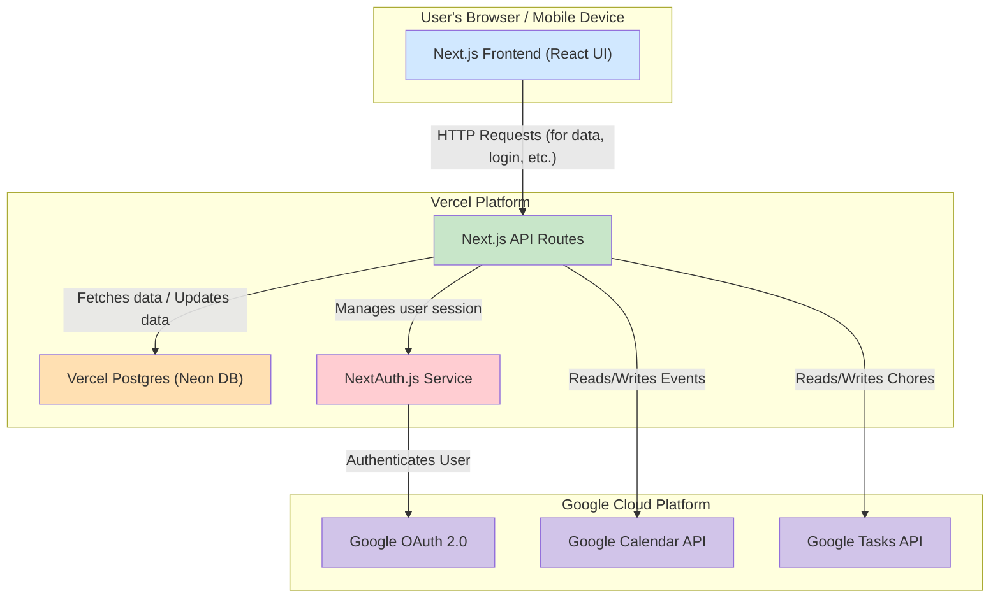

# Family Hub: Architecture Document

**Version**: 1.0
**Date**: 2025-07-09
**Status**: Finalized

## 1. Introduction

### 1.1. Purpose of this Document

This document details the software architecture for the Family Hub project. It is the technical blueprint intended for the development team and serves as the bridge between the **Product Requirements Document (PRD)** and the implementation of the codebase. It defines the high-level structure of the system, the technology stack, core design patterns, and the data models required to build the application.

### 1.2. Project Overview

The Family Hub is a dedicated, always-on smart display and mobile application designed to be a central organizational hub for families. It aims to reduce the mental load of running a household by providing a single, consolidated view of calendars and chores. Key features include real-time, two-way synchronization with Google Calendar and Google Tasks, a gamified chore system with points and rewards, and multi-user support for all family members. The full list of features and requirements is detailed in the official **[Family Hub PRD]**.

## 2. Core Architectural Principles & Decisions

This architecture is guided by the following principles, derived from the project's goals and non-functional requirements (NFRs) outlined in the PRD.

- **AI-First Development**: This project will be actively developed using AI, specifically **"Claude Code"**. All code, documentation, and development processes will be designed to be "AI-ready." This means creating clear, well-documented code, maintaining detailed process documents (like this one), and leveraging the configured Model Context Protocol (MCP) servers to ensure the AI has the context it needs to be an effective development partner.
- **Simplicity and Maintainability**: We will prioritize clean, well-documented code and a straightforward architecture. The choice of a **Next.js Monolith** with integrated API routes supports this by keeping the frontend and backend tightly coupled, reducing deployment complexity. (Ref: PRD Section 4)
- **Performance & Responsiveness**: The application must feel fast. To achieve this, we will employ server-side rendering (SSR) for the initial page load and a **client-side orchestration pattern** for fetching and progressively rendering data like calendar events. This ensures a responsive UI even with multiple linked accounts. (Ref: PRD Epic 5)
- **Scalability & Security**: While starting as a monolith, the use of serverless functions for our API routes allows for individual endpoints to scale independently. All security-sensitive operations, especially those involving OAuth tokens, will be handled on the backend. We will rely on industry-standard libraries like **NextAuth.js** and secure database practices (e.g., encrypting refresh tokens) to ensure the system is secure. (Ref: PRD Epic 2, Epic 4)
- **Developer Experience (DX) & Modern Tooling**: A happy and productive development team builds better software. We will invest in a state-of-the-art development environment using an **NX monorepo**, `pnpm` for efficient package management, and a full suite of linting, formatting, and automated release tooling. As a rule, **all dependencies and libraries should be initialized and maintained at their latest stable versions** to maximize security, performance, and access to modern features. (Ref: PRD Epic 1, user)

## 3. Technology Stack

The following technology stack has been chosen to meet the requirements outlined in the PRD.

| Category                        | Technology                                                    | Rationale                                                                                                   |
| :------------------------------ | :------------------------------------------------------------ | :---------------------------------------------------------------------------------------------------------- |
| **Framework**                   | [Next.js](https://nextjs.org/) (with React)                   | The industry standard for production React applications. Provides SSR, API routes, and a robust ecosystem.  |
| **Language**                    | [TypeScript](https://www.typescriptlang.org/)                 | Provides type safety, improving code quality and maintainability.                                           |
| **Database**                    | [Vercel Postgres (Neon)](https://vercel.com/storage/postgres) | Serverless, managed PostgreSQL that integrates seamlessly with our Vercel deployment platform.              |
| **ORM**                         | [Prisma](https://www.prisma.io/)                              | Modern, type-safe Object-Relational Mapper that simplifies database interactions.                           |
| **Authentication**              | [NextAuth.js (Auth.js)](https://next-auth.js.org/)            | The de-facto standard for authentication in Next.js. Securely handles OAuth and session management.         |
| **Internationalization (i18n)** | [next-i18next](https://github.com/i18next/next-i18next)       | The standard library for providing multi-language support in Next.js applications.                          |
| **Deployment**                  | [Vercel](https://vercel.com/)                                 | Provides a world-class, zero-configuration deployment platform perfectly optimized for Next.js.             |
| **Monorepo Mgmt**               | [NX](https://nx.dev/) & [pnpm](https://pnpm.io/)              | NX provides intelligent build caching and task orchestration, while pnpm ensures efficient dependency mgmt. |
| **Styling**                     | [Tailwind CSS](https://tailwindcss.com/)                      | A utility-first CSS framework that allows for rapid, consistent UI development.                             |
| **State Management**            | React Context / [Zustand](https://zustand-demo.pmnd.rs/)      | Context for simple, localized state. Zustand for more complex, global state requiring performance.          |

## 4. System Architecture Diagram

This diagram illustrates the high-level architecture of the Family Hub application, showing the relationships between the frontend, backend, database, and external Google services.



## 5. Data Models / Schema

The following Prisma schema defines the structure of our application's data stored in the Vercel Postgres (Neon) database. This schema is the single source of truth for our database tables and the relationships between them.

### 5.1. Prisma Schema Definition

```prisma
// This is your Prisma schema file,
// learn more about it in the docs: https://pris.ly/d/prisma-schema

generator client {
provider = "prisma-client-js"
}

datasource db {
provider = "postgresql"
url      = env("DATABASE_URL")
}

// User model: Represents a family member.
// Managed by NextAuth.js and our application.
model User {
id            String    @id @default(cuid())
name          String?
email         String?   @unique
emailVerified DateTime?
image         String?
points        Int       @default(0) // For the gamification system
accounts      Account[]
sessions      Session[]

// Relation to linked accounts that this user has authorized
linkedAccounts LinkedAccount[]

// Relation to chores assigned to this user
assignedChores Chore[]

@@map("users")
}

// LinkedAccount model: Stores refresh tokens for external Google accounts.
// This is essential for fetching calendar data for the whole family.
model LinkedAccount {
id           String @id @default(cuid())
email        String @unique
refreshToken String // This will be encrypted before being stored
userId       String
user         User   @relation(fields: [userId], references: [id], onDelete: Cascade)

@@map("linked\_accounts")
}

// Chore model: Stores our application-specific metadata for chores.
model Chore {
id           String @id @default(cuid())
googleTaskId String @unique // Links to the task in Google Tasks
points       Int
status       ChoreStatus @default(ACTIVE)
assignedToId String
assignedTo   User   @relation(fields: [assignedToId], references: [id], onDelete: Cascade)

@@map("chores")
}

// Reward model: Defines the rewards that can be redeemed with points.
model Reward {
id          String @id @default(cuid())
title       String
description String?
pointCost   Int

@@map("rewards")
}

// NextAuth.js Required Models
// These are standard models required for NextAuth.js to function.
model Account {
id                 String  @id @default(cuid())
userId             String
type               String
provider           String
providerAccountId  String
refresh\_token      String? @db.Text
access\_token       String? @db.Text
expires\_at         Int?
token\_type         String?
scope              String?
id\_token           String? @db.Text
session\_state      String?

user User @relation(fields: [userId], references: [id], onDelete: Cascade)

@@unique([provider, providerAccountId])
@@map("accounts")
}

model Session {
id           String   @id @default(cuid())
sessionToken String   @unique
userId       String
expires      DateTime
user         User     @relation(fields: [userId], references: [id], onDelete: Cascade)

@@map("sessions")
}

model VerificationToken {
identifier String
token      String   @unique
expires    DateTime

@@unique([identifier, token])
@@map("verification\_tokens")
}

enum ChoreStatus {
ACTIVE
PENDING\_APPROVAL
APPROVED
}
```

## 6. API Endpoint Definitions

This section details the RESTful API endpoints that the Next.js backend will expose. These endpoints are the interface between the frontend UI and our server-side logic and data.

### 6.1. Authentication API

Managed by **NextAuth.js**. The frontend will interact with these via the `signIn()` and `signOut()` functions provided by the library.

- **`POST /api/auth/[...nextauth]`**
  - **Description**: A catch-all route that handles all authentication-related requests, including initiating the Google OAuth flow, handling the callback, and managing sessions.
  - **Interaction**: Managed by the NextAuth.js library.

### 6.2. Calendar API

- **`GET /api/calendars/list`**
  - **Description**: Fetches a list of all calendar sources (primary user + linked accounts + subscribed calendars) available to the current user.
  - **Response Body**:
    ```json
    [
      { "id": "user@example.com", "color": "#FF5733" },
      { "id": "child@example.com", "color": "#33C4FF" },
      { "id": "holidays@group.v.calendar.google.com", "color": "#808080" }
    ]
    ```

- **`GET /api/calendars/events?id={calendarId}`**
  - **Description**: Fetches all calendar events for a single, specified calendar ID for a given time range.
  - **Request Params**: `id` (string) - The ID of the calendar to fetch.
  - **Response Body**:
    ```json
    [
      {
        "title": "Team Meeting",
        "start": "2025-07-09T09:00:00Z",
        "end": "2025-07-09T10:00:00Z"
      }
    ]
    ```

- **`POST /api/calendar/events/create`**
  - **Description**: Creates a new event in a specified Google Calendar.
  - **Request Body**: `{ "calendarId": "...", "title": "...", "start": "...", "end": "..." }`
  - **Response Body**: The newly created event object.

- **(Additional endpoints for `update` and `delete` will also be created as per Epic 6)**

### 6.3. Linked Account API

- **`GET /api/account/link`**
  - **Description**: Initiates the Google OAuth flow for linking a new external account.
  - **Interaction**: Redirects the user to the Google consent screen.

- **`DELETE /api/account/unlink`**
  - **Description**: Unlinks an external account and revokes its refresh token.
  - **Request Body**: `{ "linkedAccountId": "..." }`
  - **Response Body**: `{ "success": true }`

### 6.4. Chore & Reward API

- **`GET /api/chores/list`**
  - **Description**: Fetches the consolidated list of all family chores, enriched with metadata from our database.
  - **Response Body**:
    ```json
    [
      {
        "googleTaskId": "...",
        "title": "Clean room",
        "assignedToId": "...",
        "points": 10,
        "status": "ACTIVE"
      }
    ]
    ```

- **`POST /api/chores/approve`**
  - **Description**: Approves a completed chore and awards points to the user.
  - **Request Body**: `{ "choreId": "..." }`
  - **Response Body**: The updated user object with their new point total.

- **(Additional endpoints for chore creation, denial, reward management, and redemption will be created as per Epics 7 & 8)**

## 7. Project & Code Structure

This section outlines the definitive directory structure for the Family Hub NX monorepo. This structure is designed to enforce a clean separation of concerns and support our "AI-First Development" principle by making the codebase predictable and easy to navigate.

### 7.1. Root Directory Structure

```
/
├── apps/
│   └── web/            # The main Next.js application (frontend and API routes)
├── docs/
│   ├── README.md
│   ├── CONTRIBUTING.md
│   ├── PRD.md
│   └── ARCHITECTURE.md
├── packages/
│   ├── config/         # Shared configurations (ESLint, TypeScript, Tailwind)
│   ├── ui/             # Shared React components (e.g., buttons, cards)
│   └── lib/            # Shared library code (e.g., database clients, utils)
├── prisma/
│   ├── schema.prisma   # Our single source of truth for the database schema
│   └── migrations/     # Auto-generated database migration files
├── .github/
│   └── workflows/      # CI/CD workflows for testing and deployment
├── .husky/             # Git hooks configuration
├── CLAUDE.md           # Instructions for AI-assisted development
├── nx.json             # NX workspace configuration
├── package.json        # Root package file for the monorepo
└── pnpm-workspace.yaml # pnpm workspace configuration
```

### 7.2. Application Structure (`apps/web`)

The main Next.js application will follow the standard App Router conventions:

```
apps/web/
├── src/
│   ├── app/
│   │   ├── (auth)/         # Group for auth pages (sign-in, etc.)
│   │   ├── (main)/         # Group for main app views (calendar, chores)
│   │   │   ├── layout.tsx
│   │   │   ├── calendar/
│   │   │   └── chores/
│   │   ├── api/            # All backend API routes
│   │   │   ├── auth/
│   │   │   ├── calendar/
│   │   │   └── chores/
│   │   └── layout.tsx      # Root layout of the application
│   ├── components/         # Application-specific components
│   └── lib/                # Client-side helper functions and hooks
└── ...
```
